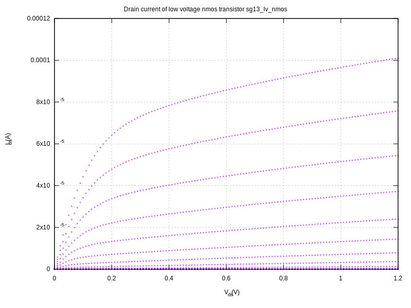
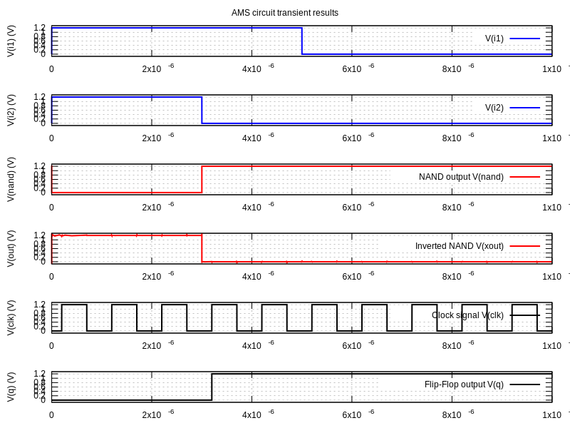

Simulation using Gnucap
**************************

.. _gnucap_configuration_lbl:

Introduction to Gnucap 
======================

Gnucap circuit simulator is an open-source modern circuit simulator with support for
VerilogAMS. It is hosted at several mirrors but the most up to dater is the one on 
`codeberg <https://codeberg.org/gnucap/gnucap>`_. The documentation is fragmented 
and the adoption in open source EDA tools is limited. However, gnucap is a powerful
tool especially for mixed signal simulation.


Gnucap and gnucap-modelgen-verilog installation on ubuntu 22.04 LTS 
====================================================================

Due to gnucap's modular architecture the installation process consists of two basics steps: 

#. installation of gnucap - main application
#. installation of gnucap-modelgen-verilog - Verilog-AMS model generator/compiler


The gnucap installation is straightforward. 
The source code can be obtained from `this repository <https://codeberg.org/gnucap/gnucap>`_.
In order to install gnucap the following commands should be executed:

.. code-block:: bash
    
    cd 
    git clone https://codeberg.org/gnucap/gnucap.git gnucap
    cd gnucap
    ./configure 
    make
    sudo make install

The same method applies to the gnucap-modelgen-verilog tool, 
which can be obtained from `this website <https://codeberg.org/gnucap/gnucap-modelgen-verilog>`_.
It is used to compile Verilog-AMS models to be included in gnucap simulation engine. 

.. code-block:: bash
    
    cd 
    git clone https://codeberg.org/gnucap/gnucap-modelgen-verilog.git gnucap-modelgen-verilog
    cd gnucap-modelgen-verilog
    ./configure 
    make
    sudo make install

Gnucap basic example
==========================

There are not many basic/medium level examples in the public space on how to simulate 
circuits with gnucap. Nevertheless both repositories contain not only sources but also an
extensive test suites, where many examples can be found. 

This document presents a basic examples of usage of gnucap using IHP SG13G2 PDK devices.

.. note::

  Gnucap is interactive and has a unique feature, where you can switch between netlist formats at runtime.
  Currently it supports Spice, Verilog-AMS and spectre formats.

.. code-block:: verilog

    // Verilog
    verilog
    load mgsim
    load vams/vpulse.so
    load ../../plugins/psp103_nqs.so
    load ../../plugins/cornerMOSlv_tt.so
    options log

    // Circuit
    // verilog style
    ground gnd;
    sg13_lv_nmos #(.w(1.0e-6), .l(0.13e-6), .ng(1)) XM1(nd, ng, gnd, gnd);

    // spice style
    spice
    Vgs ng gnd 0.4
    Vds nd gnd 1.2

    // simulation setup spice-like
    .print dc ids(XM1.M1) v(nodes)
    .dc Vds 0 1.2 0.01 Vgs 0.0 0.8 0.05 > gnucap.txt

Gnucap uses C/C++ style comments (//) for verilog mode and spice style comments (// and \*) for spice mode.
The ``verilog`` keyword switches gnucap to verilog-ams mode, while the ``spice`` keyword switches gnucap to spice mode.
The ``load`` command is used to load the required plugins for the simulation. In particular the ```vams/vpulse.so``` plugin is 
required for pulse sources and it was generated form a Verilog-AMS description using the gnucap-modelgen-verilog tool.
The psp103_nqs.so and cornerMOSlv_tt.so plugins are required for IHP SG13G2 PDK devices and are generated using the PDK libraries and 
gnucap-modelgen-verilog tool as well. The ``options log`` command enables logging of the simulation progress.

The next section of the circuit describes the circuit itself. In this case a single NMOS transistor is instantiated using Verilog-AMS style.
The ground command introduces the ground node. The transistor is instantiated using the ``sg13_lv_nmos`` module with parameters for width, 
length and number of gates. The transistor terminals are connected to nodes ``nd`` (drain), ``ng`` (gate) and ``gnd`` (source and bulk).
The next section of the netlist describes the voltage sources using spice style. Two voltage sources are defined: ``Vgs`` for gate-source voltage
and ``Vds`` for drain-source voltage. The simulation setup section defines the output to be printed and the nested DC sweep analysis redirected 
to a file named ``gnucap.txt``. The file contains columns of data for the drain current and node voltages for each combination of Vds and Vgs values.


.. code-block:: bash
        
     #          ids(XM1.M1) v(gnd)     v(nd)      v(ng)     
     0.         0.         0.         0.         0.        
     0.01       1.74E-12   0.         0.01       0.        
     0.02       3.003E-12  0.         0.02       0.        
     0.03       3.921E-12  0.         0.03       0.        

One of the easiest way to plot the data is to use either python matplotlib or gnuplot. The following example shows a gnuplot script, which plots
the drain current vs Vds for different Vgs values.

.. code-block:: gnuplot
        
    # For PDF output
    #set terminal pdfcairo size 800,600
    #set output "sg13_lv_nmos.pdf"
    # For SVG output
    set terminal svg size 800,600 
    set output "sg13_lv_nmos.svg"

    set multiplot layout 1,1 title "Drain current of low voltage nmos transistor sg13\\_lv\\_nmos"

    set grid
    set ylabel "I_{ds} (A)"
    set xlabel "V_{ds} (V)"
    unset key
    plot "gnucap.txt"  using 1:2 with points pt 3 ps 0.3

    unset multiplot
    set output


The SVG output of the plot is shown below:




Compiling a Verilog-A model to be used in a simulation
======================================================

The gnucap-modelgen-verilog tool is used to compile Verilog-A models to be used in gnucap simulations.  
This step can be executed using the following one-liner command:


.. code-block:: bash
        
    gnucap-mg-vams --cc model.vams   | g++ -xc++ `gnucap-conf --cppflags` -fPIC -shared - -o model.so

In this example the Verilog-AMS model is contained in the ``model.vams`` file and the output shared object file is ``model.so`` and can 
be loaded in gnucap using the ``load`` command as shown in the previous example.

The following code shows a basic Verilog-A models of a 2 input NAND gate and a D-type flip-flop.

.. code-block:: verilog


    `include "disciplines.vams"

    module anand (out, in1, in2);

    input in1, in2; 
    output out; 
    electrical out;
    electrical in1, in2;
    parameter real vh = 1.2;			// output electrical in high state
    parameter real vl = 0;			// output electrical in low state
    parameter real vth = (vh + vl)/2;	// threshold electrical at inputs
    parameter real td = 0 from [0:inf);	// delay to start of output transition
    parameter real tt = 0 from [0:inf);	// transition time of output signals

    analog begin
        @(cross(V(in1) - vth) or cross(V(in2) - vth));

        V(out) <+ transition( !((V(in1) > vth) && (V(in2) > vth)) ? vh : vl, td, tt );
    end
    endmodule

    module dff1 (q, qb, clk, d);

    output q; 
    electrical q;	// Q output
    output qb; 
    electrical qb;	// Q bar output
    input clk; 
    electrical clk;	// Clock input (edge triggered)
    input d; 
    electrical d;	// D input
    parameter real td = 0 from [0:inf);	// delay from clock to q
    parameter real tt = 0 from [0:inf);	// transition time of output signals
    parameter real vh = 1.2;			// output voltage in high state
    parameter real vl = 0;			// output voltage in low state
    parameter real vth = (vh + vl)/2;	// threshold voltage at inputs
    parameter integer dir = +1 from [-1:+1] exclude 0;
                // if dir=+1, rising clock edge triggers flip flop 
                // if dir=-1, falling clock edge triggers flip flop 
    real state;

    analog begin
        @(cross(V(clk) - vth, dir))
        state = (V(d) > vth);

        V(q) <+ transition( state ? vh : vl, td, tt );
        V(qb) <+ transition( state ? vl : vh, td, tt );
    end
    endmodule


After compilation the model was included in the following framework of the simulation:

.. code-block:: verilog

    load mgsim
    load ./gates.so
    load vams/vpulse.so
    load ../../plugins/psp103_nqs.so
    load ../../plugins/cornerMOSlv_tt.so
    load ../../plugins/capacitor.so
    // options log
    verilog
    ground gnd;  
    anand xnand(nand, i1, i2);
    dff1 xdff(q, qb ,clk, nand);

    sg13_lv_nmos #(.w(1.0e-6), .l(0.13e-6), .ng(1)) XM1(xout, nand, vss, vss);
    sg13_lv_pmos #(.w(1.0e-6), .l(0.13e-6), .ng(1)) XM2(xout, nand, vdd, vdd);
    sp_capacitor #(.capacitance(1e-14)) C1(xout, gnd);
    sp_capacitor #(.capacitance(1e-14)) C2(q, gnd);
    sp_capacitor #(.capacitance(1e-14)) C3(qb, gnd);

    spice
    Vdd1 vdd gnd 1.2
    Vss1 vss gnd 0.0
    V1 i1 gnd pulse(0, 1.2, 0, 1n, 1n, 5u, 10u)
    V2 i2 gnd pulse(0, 1.2, 0, 1n, 1n, 3u, 10u)
    Vclk clk gnd pulse(0, 1.2, 200n, 1n, 1n, 500n, 1u)

    .print tran   v(i1) v(i2) v(nand) v(xout) v(clk) v(q)
    .tran  10u  > tran.txt trace off quiet
    .status 
 
Gnucap will redirect the transient simulation output into ``tran.txt`` file. 


The additional measurements are stored added to a file ``file``, which
stores the voltages at specific time instants.

.. warning::

  In order to make the measurements work properly the ``store tran v(*)`` command is required to store all node voltages.

The associated gnuplot script to plot the transient response is shown below:

.. code-block:: gnuplot 

    
    # For PDF output
    #set terminal pdfcairo size 800,600
    #set output "gates.pdf"
    # For SVG output
    set terminal svg size 800,600 
    set output "gates.svg"
    set multiplot layout 6,1 title "AMS circuit transient results"
    set grid
    set yrange [-0.1:1.3]
    set style line 1 lc rgb "blue"  lw 2
    set style line 2 lc rgb "red"   lw 2
    set style line 3 lc rgb "black" lw 2

    set ylabel "V(i1) (V)"
    plot "tran.txt" using 1:2 with lines ls 1 title "V(i1)"

    set ylabel "V(i2) (V)"
    plot "tran.txt" using 1:3 with lines ls 1 title "V(i2)"

    set ylabel "V(nand) (V)"
    plot "tran.txt" using 1:4 with lines ls 2 title "NAND output V(nand)"

    set ylabel "V(xout) (V)"
    plot "tran.txt" using 1:5 with lines ls 2 title "Inverted NAND V(xout)"

    set ylabel "V(clk) (V)"
    plot "tran.txt" using 1:6 with lines ls 3 title "Clock signal V(clk)"

    set ylabel "V(q) (V)"
    plot "tran.txt" using 1:7 with lines ls 3 title "Flip-Flop output V(q)"

    unset multiplot

    set output

The SVG output of the plot is shown below:



As shown on the plot the NAND gate output follows the expected truth table and the flip-flop captures the NAND gate output at the rising edge of the clock signal.
Additionally the inverted made out of primitive low voltage complementary devices inverts the input signal correctly. The inverter output contains 
some artefacts characteristic for analog simulation, which are not present at other nodes due to the applied model. 

.. note:: Conclusions

  The presented circuit mixes different levels of Verilog-A modelling styles. The NAND gate is modelled using 
  behavioral approach neglecting underlying device level of hierarchy as well as the flip-flop. 
  In the testbench the testand module was defined instantiating the NAND gate, the flip-flop and associated voltage 
  sources for generating stimuli. 
  The transient analysis was defined using the ``tran`` command and the results were stored in a file named ``tran.txt``.
  This approach is suitable for fast digital simulations, where the focus is on the logic functionality. 


References
================

You can find some more resources here:

#. Official documentation Gnucap_
#. Source code + test suites CodebergSite_
#. FOSDEM 2018 Gnucap talk Fosdem2018_
#. FOSDEM 2017 Gnucap talk Fosdem2017_
#. IGER 2023 Gnucap talk IGER2023_
#. An overview of algorithms in Gnucap IEEE2023_
#. The gnucap model compiler IEEE2022_

.. _Gnucap: http://gnucap.org
.. _CodebergSite: https://codeberg.org/gnucap/
.. _Fosdem2018: https://www.youtube.com/watch?v=5a1N_Dm1muc
.. _Fosdem2017: https://www.youtube.com/watch?v=zyeMORbswKk
.. _IGER2023: https://www.youtube.com/watch?v=nacG9UwvoLw
.. _IEEE2023: https://ieeexplore.ieee.org/document/1225766
.. _IEEE2022: https://ieeexplore.ieee.org/abstract/document/1291068/

