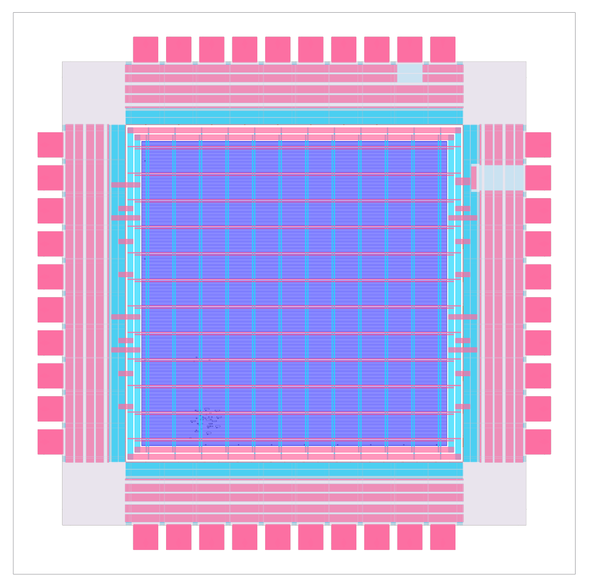
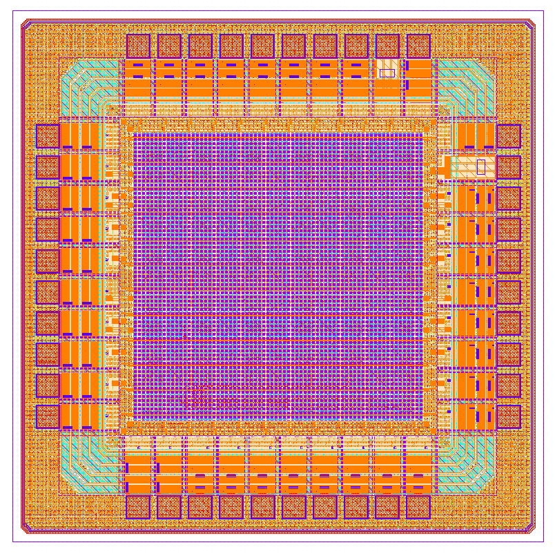

# Full Chip Design With Librelane

This page demonstrates how to create a full chip design using LibreLane.
If you only want to create a macro using LibreLane, please take a look at [LibreLane](./librelane).

To get started, clone the IHP LibreLane template: https://github.com/IHP-GmbH/ihp-sg13g2-librelane-template

The template contains a Nix setup, so if you have installed LibreLane via Nix, you can simply run `nix-shell` in the repository to enable an environment with the correct tool versions.

The template automatically assembles the pad ring, performs place and route of your design, inserts the seal ring, performs filler generation, runs the DRC checks, extracts the design and runs LVS.

Once the design has been implemented, it can be viewed using the OpenROAD GUI and KLayout.

|  |   |
|---|---|
| Fig 1. LibreLane chip in OpenROAD GUI  | Fig 2. LibreLane chip in KLayout  |

The template includes a [cocotb](https://www.cocotb.org/) testbench, which can run with the RTL, or, after implementation, with the GL netlist.

Follow the instructions in the template to customize both the design and the testbench to your needs.
