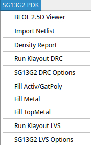
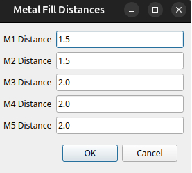
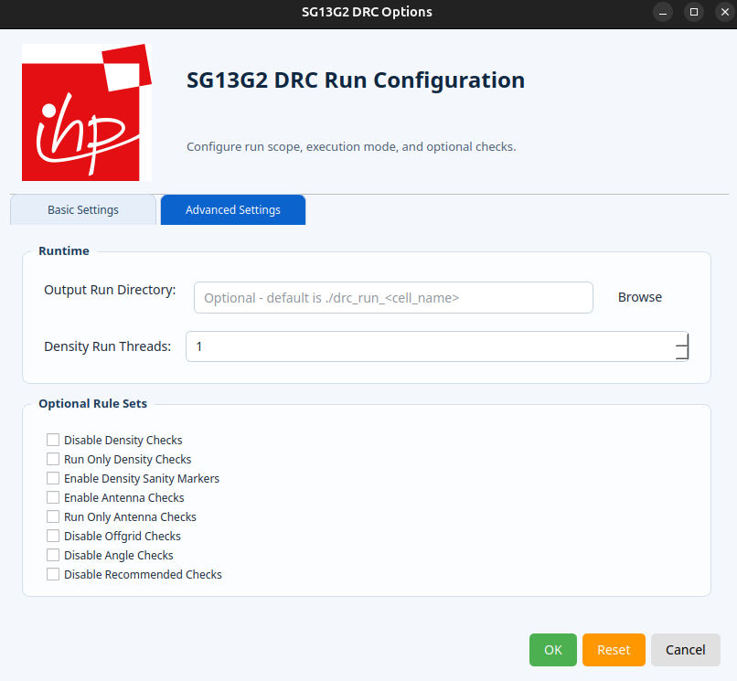

.. _filler_generation_lbl:

Filler Generation
=================

Dummy metal fill ensures uniform metal density distribution across the integrated circuit layout. In regions with sparse metal features, the metal density differs significantly from densely routed areas. This non-uniformity adversely affects chemical-mechanical polishing (CMP) processes, resulting in over-polishing (dishing) in low-density regions and under-polishing in high-density regions. These surface variations degrade subsequent layer quality and can lead to manufacturing defects, reduced yield, and reliability concerns. Dummy metal fill addresses this issue by inserting electrically inactive metal shapes in sparse regions to achieve uniform density distribution, thereby ensuring consistent CMP performance and improved fabrication outcomes.

.. note::
   It is mandatory to have a ``sealring`` in the design which can be dragged and dropped from the ``libraries`` menu in klayout left pane.

KLayout
=======

The filling process can be executed either using a menu item from KLayout's GUI or the command line using the provided Python script.
The ``SG13G2 PDK`` menu has several items related to the fillers.  The ``Fill Activ/GatPoly``, ``Fill Metal`` and ``Fill Top Metal`` 
will generate filler shapes on the corresponding layers. The ``Density Report`` will calculate the densities and report it in the terminal
window.

As an alternative one can use the python script for generating fillers:

.. code-block:: bash

   klayout -n sg13g2 -zz -r $PDK_ROOT/$PDK/libs.tech/klayout/tech/scripts/filler.py -rd output_file=./design_filled.gds design_nofill.gds

Controlling Metal Filler Densities
**********************************

The adjustment of the Metals 1-5 densities can be changed by modification of distances between the metal fillers, where the minimal
spacing between metal fillers is ``0.42um``.

In order to adjust metal filler densities using CLI interface, modify the following scripts:

.. code-block:: bash

  $PDK_ROOT/$PDK/libs.tech/klayout/tech/scripts/macros/sg13g2_filler_Metal.lym
  $PDK_ROOT/$PDK/libs.tech/klayout/tech/scripts/macros/sg13g2_filler_TopMetal.lym

Within these scripts, the ``width``, ``length``, and ``distance`` parameters can be adjusted to achieve the desired density levels. Ensure that all modifications comply with DRC rules for filler cell sizing and separation, as specified in sections ``5.18`` and ``5.23`` of the ``SG13G2_Layout_Rules_os.pdf`` document.

Verification
************

After applying the fillers, the first step is to verify that the desired density levels are met using the Density Report tool available in the ``SG13G2 PDK`` menu.

.. note::
   When running minimal DRC checks in KLayout, ``AFil.g2`` and ``M1-5Fil.h`` errors may appear for regions outside the design area where densities are calculated. These errors can be safely waived.

The final check is to run DRC with default options and make sure that ``Disable Denisty Check`` under Advanced options is ``not checked``.

In order to speed up the process of density checking on large designs one can check ``Run Only Density Check`` and increase number of ``Density Run Threads``.

.. warning::
   The density checks are part of the rejection test during the submission process. If your desing does not meet the required values it will be rejected. 

gdsfill
=======

``gdsfill`` is an open-source tool for inserting dummy metal fill into semiconductor layouts. It helps designers meet density requirements and prepare GDSII layouts for manufacturing by analyzing, erasing, and generating dummy fill patterns across multiple layers. The tool is designed to integrate easily into existing design flows and ensures reproducible, automated preparation of layouts before tape-out.

For more information visit the official `GitHub page <https://github.com/aesc-silicon/gdsfill>`_.

Installation
************

**gdsfill** can be installed as a Python package. We recommend using a virtual environment to keep dependencies isolated.

.. code-block:: text

   $ python3 -m venv venv
   $ source venv/bin/activate
    (venv) $ pip install --upgrade pip
   (venv) $ pip install gdsfill

Density
*******

This command calculates the utilization per layer and prints the values.
It is useful to check layer density before and after running the fill process:

.. code-block:: text

   gdsfill density <my-layout.gds>

Erase
*****

If a layout already contains dummy fill, or if previous fills should be removed, this command erases all dummy metal fill from a layout:

.. code-block:: text

   gdsfill erase <my-layout.gds>

Fill
****

To insert dummy metal fill into all supported layers of a layout, run:

.. code-block:: text

   gdsfill fill <my-layout.gds>

By default, **gdsfill** creates a temporary directory for intermediate data.
Use ``--keep-data`` to retain all generated files in a directory called ``gdsfill-tmp``:

.. code-block:: text

   gdsfill fill <my-layout.gds> --keep-data

If you only want to simulate the process without modifying the layout file, use ``--dry-run``:

.. code-block:: text

   gdsfill fill <my-layout.gds> --dry-run

Custom Configuration
*********************

By default, **gdsfill** inserts dummy metal fill into each layer using predefined parameters.
To apply different parameters or restrict fill to specific layers, you can create a custom configuration file.

The following example config inserts fill only into **TopMetal1** and **TopMetal2**:

.. code-block:: yaml

   PDK: ihp-sg13g2
   layers:
     TopMetal1:
       algorithm: Square
       density: 60
       deviation: 1
     TopMetal2:
       algorithm: Square
       density: 60
       deviation: 1

.. note::
   An example config file is available in the `GitHub project <https://github.com/aesc-silicon/gdsfill/blob/main/gdsfill/configs/ihp-sg13g2.yaml>`_.

To use a custom config file, pass it with ``--config-file``:

.. code-block:: text

   gdsfill fill <my-layout.gds> --config-file <my-config-file.yaml>
