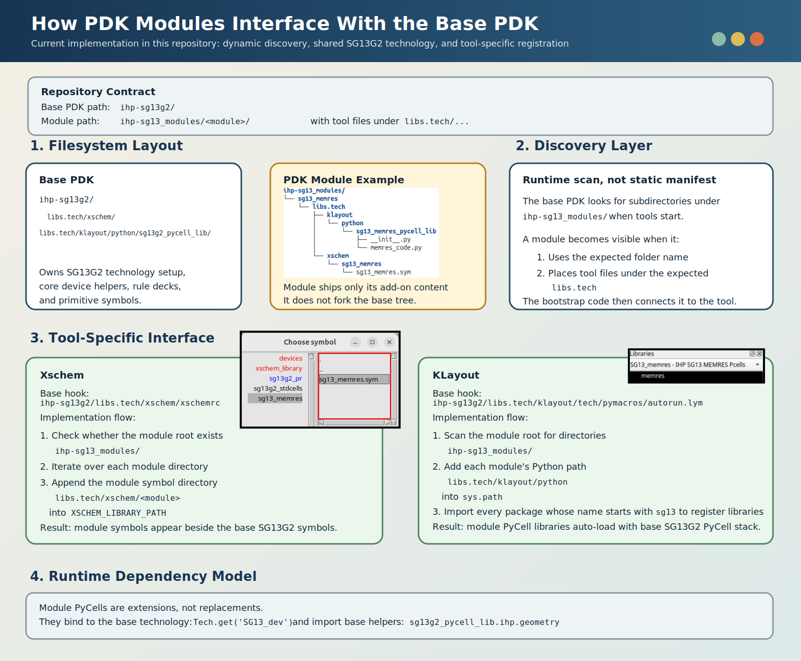

# PDK Module Interface Infographic

This infographic documents how add-on PDK modules under `ihp-sg13_modules/` are wired into the base `ihp-sg13g2/` PDK in the IHP-Open-PDK repository.

## What the implementation does

- The repository uses a sibling-tree layout: the base PDK is `ihp-sg13g2/`, while optional extensions live under `ihp-sg13_modules/<module>/`.
- Xschem discovers modules dynamically by scanning `ihp-sg13_modules/` and appending each module's `libs.tech/xschem/<module>` path into `XSCHEM_LIBRARY_PATH`.
- KLayout discovers modules dynamically by scanning `ihp-sg13_modules/`, appending each module's `libs.tech/klayout/python` path to `sys.path`, and importing packages whose names start with `sg13`.
- A module PyCell library is expected to bind to the base technology object with `Tech.get('SG13_dev')`, then register its own PCells.
- Module implementation code can depend directly on the base PyCell library. In the current `sg13_memres` example, `memres_code.py` imports `sg13g2_pycell_lib.ihp.geometry` and `sg13g2_pycell_lib.ihp.utility_functions`.

## Code references

- Xschem module path hookup: `ihp-sg13g2/libs.tech/xschem/xschemrc:443-450`
- KLayout module bootstrap: `ihp-sg13g2/libs.tech/klayout/tech/pymacros/autorun.lym:49-57`

## Practical takeaway

The interface is implemented as a discovery-and-extension pattern, not as a merge into the base PDK tree. A module remains physically separate, while the base PDK's Xschem and KLayout bootstrap code makes it visible at runtime and supplies the shared technology and helper APIs the module needs.
