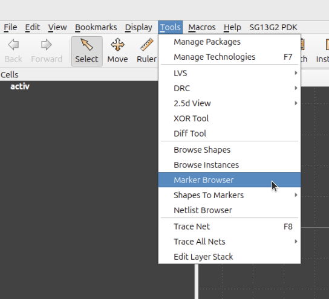
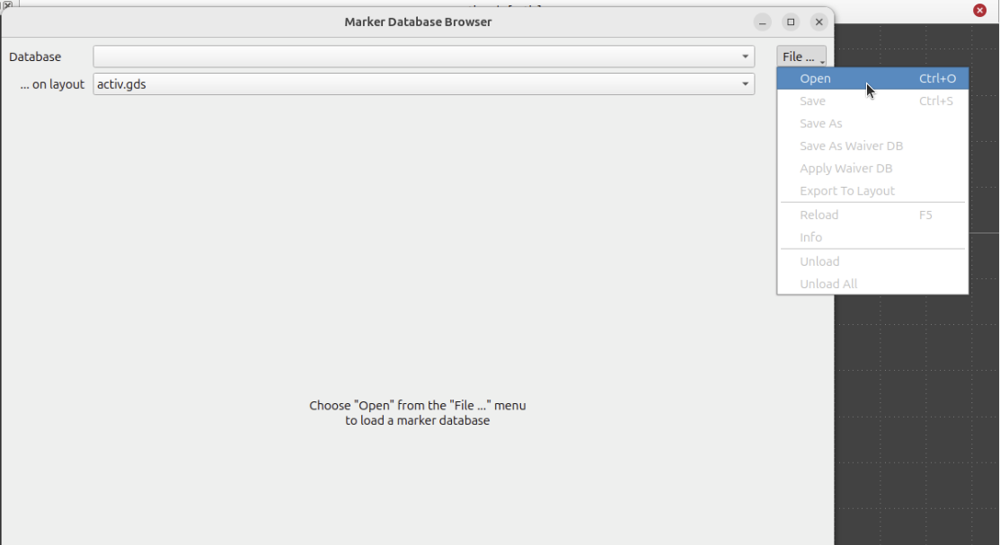
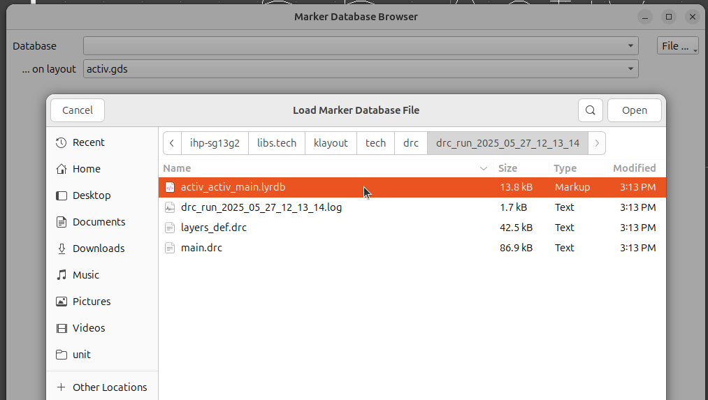
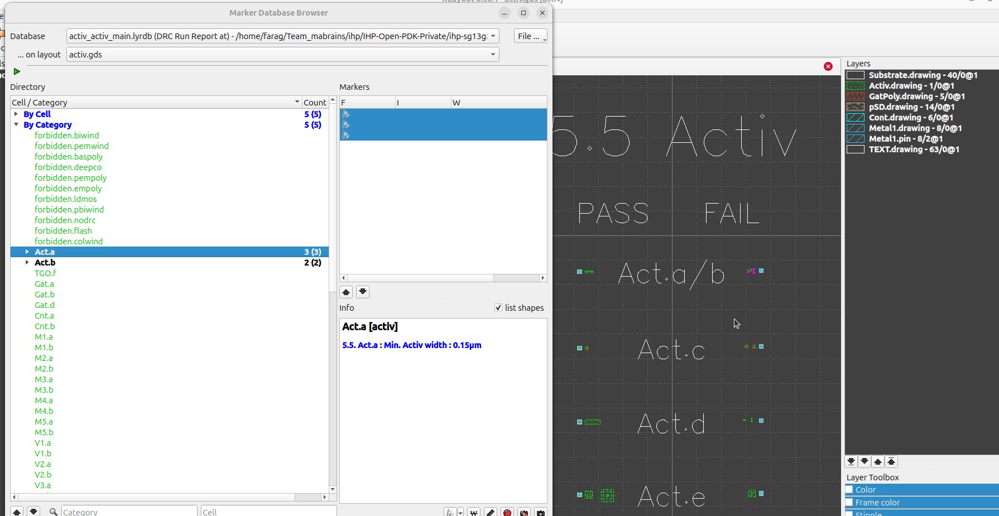
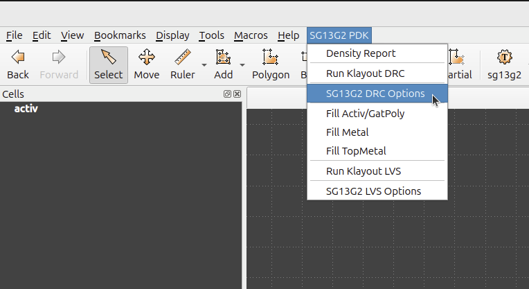
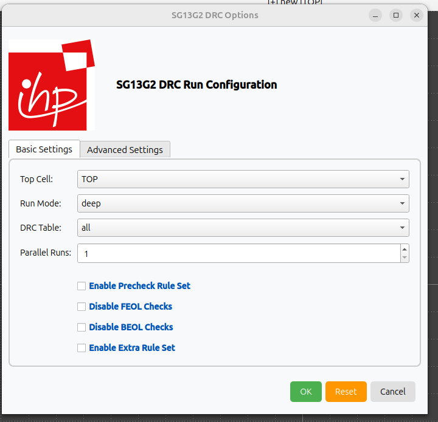
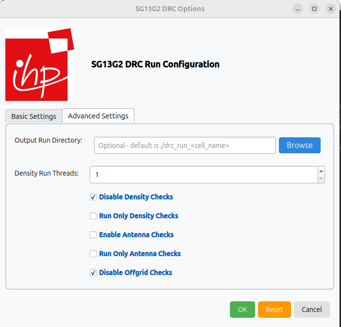
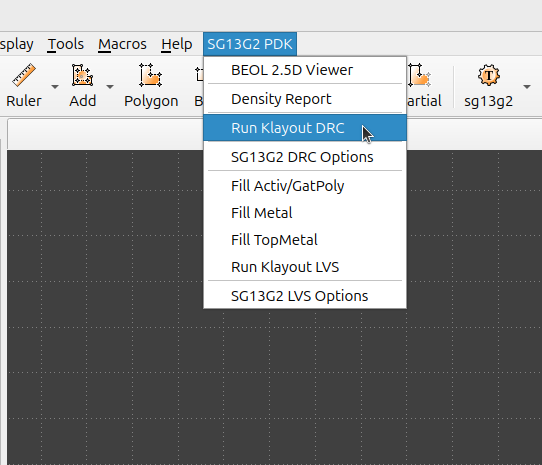
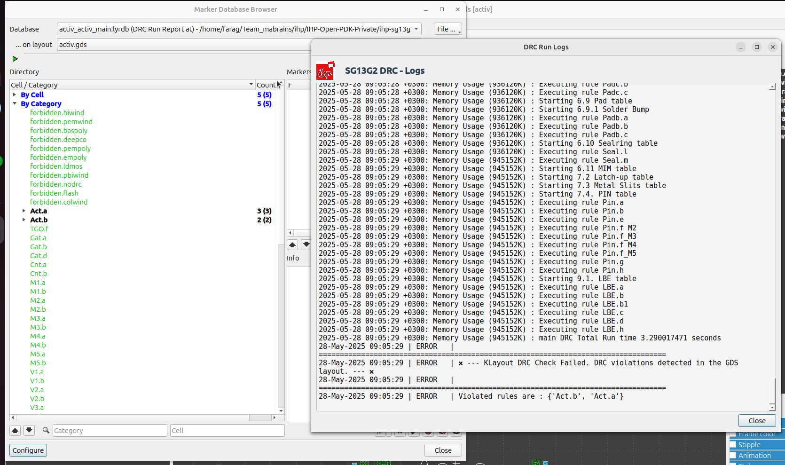

Usage
=====

.. note::
    You have the option to execute the SG13G2-DRC through either a Python script via the command-line interface (CLI) or by the Klayout graphical user interface (GUI), as detailed in the subsequent usage sections.

.. _CLI Usage:

CLI
---

The `run_drc.py` script takes your gds to run DRC rule decks with switches to select subsets of all checks.

.. code-block:: bash

  run_drc.py (--help | -h)
  run_drc.py --path=<file_path>
          [--table=<table_name>]... [--mp=<num_cores>] [--run_dir=<run_dir_path>]
          [--topcell=<topcell_name>] [--thr=<threads>] [--run_mode=<mode>] [--drc_json=<json_path>]
          [--no_feol] [--no_beol] [--MaxRuleSet] [--no_connectivity] [--no_density]
          [--density_only] [--antenna] [--antenna_only] [--no_offgrid] [--macro_gen]

**Options:**

.. code-block:: rst

    `-h, --help`            show this help message and exit
    `--path PATH`           Path to the input GDS file to be processed.
    `--table TABLE`         DRC table name(s) to execute (e.g., activ, metal1). This option can be used multiple times.
    `--mp MP`               Number of parts to split the rule deck for parallel execution. [default: 1]
    `--run_dir RUN_DIR`     Dir to store all run results. If not specified, a timestamped dir under the current path will be used.
    `--topcell TOPCELL`     Top-level cell name to use from the input GDS.
    `--thr THR`             Number of threads to use during the run.
    `--run_mode {flat,deep}`
                            KLayout execution mode: flat, deep, or tiling. [default: deep]
    `--drc_json DRC_JSON`   Path to a JSON file that defines rule values to use.
    `--no_feol`             Disable all FEOL-related DRC checks.
    `--no_beol`             Disable all BEOL-related DRC checks.
    `--MaxRuleSet`          Force execution of the full rule deck.
    `--no_connectivity`     Skip connectivity-related rules.
    `--no_density`          Disable density rule checks.
    `--density_only`        Run only density rules.
    `--antenna`             Enable antenna rule checks.
    `--antenna_only`        Run only antenna rules.
    `--no_offgrid`          Disable offgrid rule checks.
    `--macro_gen`           Only generate the DRC rule deck without running.

.. note::

   By default, the **short rule set** will be executed, which includes **density rules**.  
   To disable density checks, use the ``--no_density`` switch.

.. tip::

   If the ``--drc_json=<json_path>`` option is not provided, the script will follow this fallback order:

   - 1. Try to load **the SG13G2 tech JSON**:  
    `SG13G2 tech JSON <https://github.com/IHP-GmbH/IHP-Open-PDK/tree/dev/ihp-sg13g2/libs.tech/klayout/python/sg13g2_pycell_lib/sg13g2_tech_mod.json>`_ file.
   - 2. Fall back to **default DRC values**:  
    `default tech DRC values <https://github.com/IHP-GmbH/IHP-Open-PDK/tree/dev/ihp-sg13g2/libs.tech/klayout/tech/drc/rule_decks/default_drc_rules.json>`_ file.

**Example:**

.. code-block:: bash

        python3 run_drc.py --path=testing/testcases/unit/activ.gds --run_mode=deep --run_dir=test_activ --no_density

**DRC Outputs**

You could find the run results at your run directory if you previously specified it through `--run_dir=<run_dir_path>`. Default path of run directory is `drc_run_<date>_<time>` in current directory.

Folder Structure of run results

.. code-block:: rst

    📁 drc_run_<date>_<time>
    ┣ 📜 drc_run_<date>_<time>.log
    ┗ 📜 main.drc
    ┗ 📜 <your_design_name>.lyrdb

The outcome includes a database (`<your_design_name>.lyrdb`) containing DRC results. You can view it by opening your gds file with: `klayout <device_name>.gds -m <your_design_name>.lyrdb`. Alternatively, you can visualize it on your GDS file using the netlist browser option in the tools menu of the KLayout GUI as illustrated in the following figures.

.. rst-class:: center

    Figure 4.4.1 Marker Browser for Klayout-DRC

After selecting Marker Browser option, you could load the database file and visualize the DRC results.

.. rst-class:: center

    Figure 4.4.2 Loading DRC database file - 1

.. rst-class:: center

    Figure 4.4.3 Loading DRC database file - 2

.. rst-class:: center

    Figure 4.4.4 Visualize DRC results

GUI
---

The SG13G2 also facilitates DRC execution via Klayout menus as depicted below:

First, you need to add the DRC menus to your `KLAYOUT_PATH`, you could do that by executing the following command:

.. code-block:: bash

    KLAYOUT_PATH=$PDKPATH/libs.tech/klayout:$PDKPATH/libs.tech/klayout/tech/ klayout -e

.. tip::
    In this context, `PDKPATH` refers to the path leading to the IHP-Open-PDK/ihp-sg13g2 directory within the current repository.

Then, you will get the DRC menus for SG13G2, you could set your desired options as shown below:

.. rst-class:: center

    Figure 4.4.5 Setting up DRC Options-GUI - 1

.. rst-class:: center

    Figure 4.4.6 Setting up DRC Options-GUI - 2

.. rst-class:: center

    Figure 4.4.7 Setting up DRC Options-GUI - 3

For additional details on GUI options, please refer to the :ref:`CLI Usage`.

Finally, after setting your option, you could execute the DRC using `Run Klayout DRC` from the dropdown menu.

.. rst-class:: center

    Figure 4.4.8 Running DRC using Klayout menus

Upon executing the DRC, the result database will appear on your layout interface, allowing you to verify the outcome of the run.

.. rst-class:: center

    Figure 4.4.9 Running DRC using Klayout menus
